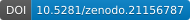

# 🦷 Vue Odontogram Modul

[](https://github.com/ZoliQua/React-Odontogram-Modul/releases)
[](https://github.com/ZoliQua/React-Odontogram-Modul)
[](https://github.com/ZoliQua/React-Odontogram-Modul/blob/main/LICENSE)
[](https://doi.org/10.5281/zenodo.21156787)

[](https://vuejs.org/)
[](https://www.typescriptlang.org/)

---

> 🌐 **Languages:**  🇬🇧 [English](../README.md#-english) | 🇪🇸 [Español](../README.md#-español) | 🇩🇪 [Deutsch](README-de.md) | 🇭🇺 [Magyar](README-hu.md) | 🇮🇹 [Italiano](README-it.md) | 🇸🇰 [Slovenčina](README-sk.md) | 🇵🇱 [Polski](README-pl.md) | 🇷🇺 [Русский](README-ru.md) | 🇧🇷 [Português (BR)](README-pt-br.md) | 🇸🇦 [العربية](README-ar.md)

---

## 🇷🇺 Русский

### 📋 Обзор
Данный проект представляет собой интерактивный браузерный редактор одонтограммы, обеспечивающий быстрое заполнение зубной карты с удобным интерфейсом. Компонент отображает многослойные SVG-шаблоны зубов для представления реставраций, кариеса, эндодонтического статуса, подвижности и других клинических данных, а также поддерживает множественный выбор, фильтры выделения и предустановленные статусные шаблоны.

---


🔗 **Test URL:** https://react-odontogram-modul.vercel.app/

---

### ✨ Основные возможности
- 🖱️ Быстрый выбор и множественный выбор (CMD/CTRL + клик)
- 🦷 Типы зубов: постоянные, молочные, имплантаты, поддесневые, отсутствующие
- 🦷 Субстрат зуба (независимо от вида реставрации): натуральный, radix (корневой остаток), сломанный, подготовлен под коронку
- 👑 Реставрации по типу × материалу: коронка / вкладка (inlay) / накладка (onlay) / винир / мост из e.max, золота, gradia, циркония, металла, металлокерамики, телескопической конструкции или временной (накладка доступна только в окклюзионном виде) — выбираются из единого комбинированного селектора «Fix: Коронка – …» с минимумом кликов; устаревшие коронки `metal` автоматически мигрируют в `metal-ceramic` (металлокерамика); имплантаты используют ту же модель тип × материал, дополненную слоем имплантационного коннектора. Селектор ограничен видом зуба: имплантат предлагает только коронку/мост (плюс пять вариантов аттачментов, см. ниже); отсутствующий зуб/дефект предлагает только тело моста (плюс съёмный частичный/полный протез); субстрат `radix` полностью скрывает элемент управления реставрацией (на корневом остатке реставрация не может быть назначена)
- 🦿 Съёмное/аттачментное протезирование на отдельной оси `prosthesis` (записи «Kivehető:» в комбинированном селекторе): формирователь десны имплантата, локатор, локатор с покрывным протезом, балка, балка с покрывным протезом; съёмный частичный или полный протез с опорой на зубы
- 🌉 Зубы моста отображают одновременно коронковую часть и седловидный коннектор; оверлей многозубого мостовидного пролёта отрисовывает единый непрерывный, учитывающий дугу коннектор через последовательные зубы моста (тело + опоры) и межзубные промежутки между ними (верхняя и нижняя дуга используют зеркальную геометрию седла, сохраняя выравнивание коннектора на обеих дугах), включён в экспорт PNG/JPG/SVG; применение моста через шаблон статусов немедленно пересчитывает оверлей
- 🔍 Картирование кариеса на 6 поверхностях: мезиальная, дистальная, щёчная, язычная, окклюзионная, подкоронковая
- 🪥 Материалы пломб по поверхностям: амальгама, композит, стеклоиономер (СИЦ), временная
- 🏥 Единый объединённый селектор «Статус пульпы / эндо» (сгруппирован: витальная пульпа vs. леченная/эндо): эндодонтические состояния (лечебное пломбирование, пломбирование канала, неполное пломбирование канала, стекловолоконный штифт, металлический штифт) и диагноз пульпы по AAE (`pulpDx`: норма / обратимый / необратимый пульпит / некроз) взаимоисключающие — зуб с эндодонтическим лечением (установлен `endo`) не может одновременно нести диагноз витальной пульпы; при лечении `pulpDx` нормализуется к `normal`, а глиф поражённой пульпы скрывается. Обратимый пульпит отображается уменьшенным глифом пульпы. Опциональная 3-уровневая настройка детализации пульпы (`pulpDetailLevel`: simple / AAE / практический латинский) раскрывает 9 практических латинских подтипов пульпы (pulpa sana … gangraena pulpae) через `pulpLatin`; резекция и парапульпарный штифт остаются отдельными специальными индикаторами
- 🦴 Апикальный диагноз (`apicalDx`: симптоматический/бессимптомный апикальный периодонтит, острый/хронический апикальный абсцесс, конденсирующий остеит) напрямую определяет периапикальный глиф; уточняющий подтип очага гранулёма/киста отображается только при симптоматическом/бессимптомном апикальном периодонтите (избыточный подтип «абсцесс» убран — он уже покрывается апикальным диагнозом)
- 🩹 Объединённая карточка «Корень и пародонт» (единый сворачиваемый раздел для находок корня/периапикальной области и пародонта)
- ⚕️ Модификации: периапикальное воспаление (отображается только на отсутствующих зубах/лунках после удаления; скрыто на присутствующих зубах, где периапикальный глиф определяется исключительно `apicalDx`, и на имплантатах, где это покрывает `periImplant`), заболевание пародонта, степени подвижности (M1/M2/M3, скрыты на имплантатах)
- 🦷🔩 Статус периимплантных тканей (`periImplant`: `none` / `mucositis` / `peri-implantitis-mild` / `peri-implantitis-moderate` / `peri-implantitis-severe`) — стадирование по классификации Всемирного семинара 2018 года, отображается как отдельный селектор на имплантатах; мукозит использует глиф пародонтальной десны, периимплантит добавляет градуированный слой `peri-implant-bone-loss` (непрозрачность 0,4/0,7/1,0). Имплантаты больше не отображают глиф периапикального очага — их воспаление выражается через эту ось — а флажки пародонтальных модификаторов скрыты на имплантатах (специальное переименование флажка «Периимплантит» упразднено)
- 🏷️ Специальные индикаторы: требуется коронка, требуется замена коронки, закрытый дефект после удаления, планируемое удаление, герметизация фиссур, потеря контактного пункта
- 👁️ Переключение видимости: окклюзионный вид, зубы мудрости, кость и пульпа
- 🔢 12 фильтров выбора (все, присутствующие, постоянные, молочные, имплантаты, отсутствующие, верхние/нижние, фронтальные/моляры)
- 📊 Предустановленные статусные шаблоны (сброс, молочный прикус, сменный прикус, беззубый)
- 📦 34 предустановленных шаблона реставраций (мосты, съёмные протезы, балочные протезы с имплантатами)
- 💾 Экспорт/импорт статуса в JSON (версия 2.10; импорт по-прежнему принимает устаревшие версии 1.4, 2.0, 2.1, 2.2, 2.3, 2.4, 2.5, 2.6, 2.7, 2.8 и 2.9 и автоматически мигрирует их, с пользовательскими состояниями плагинов и заметками к зубам)
- 🔗 Экспорт HL7 FHIR R4 (коллекция Bundle наблюдений по каждому зубу, кодирование зубов ISO 3950 для постоянного прикуса, локальная система кодов — сопоставление SNOMED CT запланировано)
- ✚ Интерфейс выбора поверхностей «крест/плюс» (B/M/O/D/L) для кариеса и пломб
- 🧱 Материалы реставраций по поверхностям (смешанные пломбы, например щёчная амальгама + дистальный композит)
- 🖼️ Экспорт зубной карты в PNG/JPG/SVG (для загрузки; PNG/JPG растеризованы из векторного SVG)
- 🦷 Кариес/вторичный кариес как конечный автомат состояний по поверхностям: кариозная поверхность без пломбы отображается как первичный кариес (непрозрачность по уровням ICDAS); как только на этой поверхности появляется пломба, она отображается как вторичный (рецидивирующий) кариес (слой `subcaries-{surface}`, с оценкой CARS) — оба состояния никогда не активны одновременно на одной поверхности
- 🎯 Единая оценка тяжести по поверхности (`cariesSeverity`, 0–6, заменяет прежние отдельные поля глубины ICDAS и CARS): читается как глубина ICDAS на первичной поверхности, как именованная оценка CARS (Здоровый … Обширная полость) на рецидивирующей, через контекстное всплывающее окно, показывающее только шкалу, соответствующую текущему состоянию поверхности
- 🌱 Кариес корня (`rootCaries`: none / active / arrested / active-cavitated), задействующий отдельный слой изображения кариеса корня с непрозрачностью, зависящей от тяжести (active 0,5 / arrested 0,7 / active-cavitated полная непрозрачность)
- 📡 Рентгенологическая глубина кариеса (`radiographicDepth`: none / E1 / E2 / D1 / D2 / D3 по поверхности), независимая от визуальной шкалы тяжести ICDAS/CARS, отображается в виде значка и передаётся через собственное наблюдение FHIR
- 🎚️ Три настройки детализации кариеса (`secondaryCariesMode`, `rootCariesMode`, `radiographicDepthMode`) и переключатель `cariesDepthEnabled`, сворачивающие каждую шкалу в более простой вид выбора без потери сохранённого значения
- 🩹 Строка сводки по вторичному кариесу на панели пломб: под элементами управления пломбами перечисляет каждый выбранный зуб со вторичным кариесом и его поверхности (например, «На пломбе зуба 36 (O) обнаружен вторичный кариес.»)
- 🪛 Дефекты пломб по поверхностям (`fillingDefect`: none / marginal / fracture / wear) на прямых реставрациях, независимо от вторичного кариеса — задаются через индикатор по поверхностям на карточке пломб (по аналогии с индикатором глубины кариеса, список опций расположен вертикально), отображаются на карте, во всплывающей подсказке и в общей сводке пломб по всей полости рта с явной меткой (например, «36 (O) – Дефект пломбы: O: краевой»), так же как маркируется вторичный кариес в строке кариеса; карточка пломб также показывает подсказку для любого выбранного зуба с зарегистрированным дефектом пломбы (например, «У зуба 36 зарегистрирован дефект пломбы.»), аналогично существующей подсказке о вторичном кариесе
- 🦷💥 Стирание зубов, типизированное по клинической причине и локализации (`wearEdge`: none / attrition (истирание) / erosion (эрозия), режущий край/окклюзионная поверхность; `wearCervical`: none / abrasion (абразия) / abfraction (абфракция) / erosion (эрозия), пришеечная область) — заменяет два бинарных флага стирания при бруксизме; задаётся через два выпадающих списка в строке стирания, использует существующую графику стирания и отображается во всплывающей подсказке и в новом сводном разделе «Стирание» по всей полости рта
- 🎨 Изменение цвета зуба по причине (`discoloration`: none / tetracycline (тетрациклиновое) / fluorosis (флюороз) / nonvital (депульпированный) / extrinsic (внешнее) / other (другое)) на постоянных и молочных зубах — придаёт отображаемой натуральной коронке репрезентативный оттенок, когда зуб не имеет реставрации и натуральный субстрат; отображается во всплывающей подсказке и в новом сводном разделе «Изменение цвета» по всей полости рта; дополняет набор поверхностных и структурных состояний наряду с дефектами пломб и стиранием
- ✏️ Передние зубы (резцы/клыки) обозначают свою жевательную поверхность как «режущая» (incisal) во всём интерфейсе (выбор, всплывающее окно, сводки); сохранённый ключ поверхности остаётся `occlusal`
- 🔤 Позиционно-зависимая нотация поверхностей (Настройки → Детали зуба → «Нотация поверхностей», simple/full, по умолчанию full): в полном режиме буква и метка поверхности кариеса/пломбы следуют анатомии зуба — occlusal → I/incisal (режущая) на передних зубах, buccal → L/labial (губная) на передних зубах, lingual → P/palatal (нёбная) на верхних зубах и L/lingual (язычная) на нижних зубах (mesial/distal/subcrown не затрагиваются); упрощённый режим всегда использует общий набор B/M/O/D/L/SC независимо от положения зуба. Применяется к сводке по всей полости рта и к обоим селекторам поверхностей (кариес и дефект пломбы) (буква + подпись); сохранённый ключ поверхности не затрагивается
- 🦷↕️ Ортодонтическое картирование по зубам (`orthoAppliance`: none / bracket (брекет) / band (кольцо); `orthoDrift`: none / mesial (мезиальный) / distal (дистальный); `orthoVertical`: none / extrusion (экструзия) / intrusion (интрузия); `orthoRotation`: логическое значение) на присутствующем натуральном зубе (постоянном или молочном) — использует ранее не задействованную графику ортодонтии версии 2.5.0 (без новых SVG); отображается на карте, во всплывающей подсказке и в новом сводном разделе «Ортодонтия» по всей полости рта
- 🪨 Зубной камень, а также резорбция корня, типизируемая как внутренняя или наружная цервикальная (`resorptionType`)
- 📏 Глубина кариеса по поверхностям (поверхностный / дентин / глубокий), или опциональная оценка по ICDAS II (0–6) через `enableIcdas`
- 🩹 Переключатель краевой негерметичности коронки, отображается только при реставрации коронкой или мостом
- 🧰 Унифицированная панель иконок в верхней части с вкладками в модальном окне настроек (Общие / Панели / Детали зуба / Кариес / Пульпа / Заметки — нумерация, заметки, видимость панелей, ICDAS, переключатель глубины кариеса, детализация кариеса корня/рентгенологической глубины, уровень детализации пульпы, информация о зубах)
- 🗂️ Вкладка настроек «Панели»: независимое отображение/скрытие сводных панелей «Статусы» и «Ортодонтия» по всей полости рта
- 🩹 Настройки вторичного кариеса (CARS) объединены с вкладкой настроек кариеса, размещены над рентгенологической глубиной (отдельная вкладка «Вторичный кариес» упразднена)
- 🎚️ Уровень детализации в разделе «Детали зуба» (Настройки → Детали зуба): настройка simple/complex для стирания зубов и для изменения цвета. Упрощённый режим показывает переключатель да/нет для каждой находки (стирание вкл. → attrition/abrasion, изменение цвета вкл. → other); сложный режим (по умолчанию) сохраняет выпадающие списки типа/причины, при этом сохранённое значение сохраняется при переключении уровней
- 📋 Панель информации о зубах: текстовое сводное описание всей одонтограммы в реальном времени (количество зубов, списки присутствующих/отсутствующих, кариес вкл. вторичный, пломбы, каналы, протетика, имплантаты, состояние пародонта) — отображается по умолчанию, переключается в настройках
- 🗂️ Сводное выпадающее меню экспорта (Статус JSON / FHIR / PNG / JPG)
- 📥 Выпадающее меню импорта с поддержкой FHIR (загружает ранее экспортированные Bundle)
- ⏳ Индикатор прогресса при экспорте изображения
- 🎓 Интерактивное обучение из 12 шагов
- 🔢 Три системы нумерации (FDI, Universal, Palmer)
- 🌐 Интернационализация (hu/en/de/es/it/sk/pl/ru/pt-br/ar) с переключателем языков (190+ ключей перевода на язык)
- 🌗 Поддержка тёмного режима с кнопкой переключения (автономный или управляемый родительским приложением)
- 🎨 Настраиваемая тема (`themeConfig` prop) с CSS-переменными (`--odon-*`)
- 📱 Мобильный сенсорный интерфейс: всплывающее окно по касанию для масштабирования, контекстное меню по долгому нажатию, масштабирование жестом «щипок», сенсорные цели WCAG 44 пикселя, переключение зубной дуги
- 🔌 Система пользовательских плагинов SVG: визуальные наложения, пользовательское состояние каждого зуба, поддержка экспорта/импорта JSON
- ⚠️ Предупреждения о несовместимых комбинациях состояний зуба
- 🏷️ Автоматические подсказки о состоянии на ячейках зубов (отображают все активные состояния)
- 🩺 Модернизированная всплывающая подсказка по зубу и сводная панель по всей полости рта: обе отображают полный набор клинических находок (диагноз пульпы/апикальный + подтип очага, резорбция корня, статус периимплантных тканей, градуированный кариес корня, зубной камень, краевая негерметичность коронки, перелом, потеря контакта, типизированное стирание края/пришеечной области), с отдельным разделом «Диагнозы» на панели, отдельным разделом «Стирание», а также приблизительным качественным показателем тяжести кариеса (поверхностный/умеренный/глубокий)
- ♿ Клавиатурная доступность (WCAG): роли ARIA listbox/option, выбор клавишами Enter/Пробел, навигация клавишами-стрелками, видимые контуры фокуса
- 🔒 Режим «только чтение»: отключение всех взаимодействий для печати, отчётов или просмотра
- ✨ Анимация выбора: пульсирующая пунктирная рамка и светящаяся тень на выбранных зубах (с поддержкой prefers-reduced-motion)
- 📝 Заметки к зубам: двойной щелчок для добавления/редактирования, значок заметки рядом с номером зуба, всплывающая подсказка с текстом заметки, экспорт/импорт в JSON
- 🧪 864 успешно проходящих автоматизированных тестов (1 дополнительный тест пропущен) (Vitest) в 94 файлах тестов: нумерация, переводы, шаблоны, i18n, компонент App, тема, сенсорный ввод, плагины, доступность и паритет клинических/диагностических осей
- 📖 Документация API TypeDoc с JSDoc-комментариями ко всем публичным экспортам (`npm run docs`)

### 📦 Модули
- 🦷 Сетка одонтограммы и интерфейс ячеек зубов
- 🎛️ Панель управления и статуса
- 🎨 Движок слоёв SVG и шаблоны
- 🔢 Нумерация зубов и сопоставление меток (FDI/Universal/Palmer)
- 🌐 Локализация (hu/en/de/es/it/sk/pl/ru/pt-br/ar)
- 💾 Экспорт/импорт статуса
- 📋 Дополнительные статусы: предустановленные шаблоны реставраций
- 🎨 Настройка темы: настраиваемая цветовая палитра через CSS-свойства `--odon-*`
- 📱 Мобильные сенсорные взаимодействия (масштабирование по касанию, долгое нажатие, масштабирование жестом «щипок», переключение дуги)
- 🔌 Система пользовательских плагинов SVG
- ⚠️ Система валидации состояний и подсказок
- ♿ Клавиатурная доступность и поддержка ARIA
- 🔒 Режим «только чтение»
- ✨ Анимация выбора
- 📝 Система заметок к зубам
- 🧪 Набор автоматизированных тестов (Vitest + `@vue/test-utils`)

### 🛠️ Элементы управления интерфейса

**🔝 Верхняя панель:**
- Переключатель языков (выпадающий список hu/en/de/es/it/sk/pl/ru/pt-br/ar)
- Кнопка переключения тёмного режима (иконка солнца/луны, переключает между светлой и тёмной темой)
- Переключатель системы нумерации (выпадающий список FDI/Universal/Palmer)
- Кнопки «Экспорт статуса» / «Импорт статуса»

**📊 Заголовок карты:**
- Переключатель окклюзионного вида
- Переключатель видимости зубов мудрости
- Переключатель видимости кости
- Переключатель видимости пульпы
- Кнопка сброса выделения

**🔍 Фильтры выбора:**
- Все / Все присутствующие / Постоянные / Молочные / Имплантаты / Все отсутствующие
- Верхние / Верхние 6 фронтальных / Верхние моляры
- Нижние / Нижние 6 фронтальных / Нижние моляры

**📋 Статусные шаблоны:**
- Сбросить всё (сброс полости рта)
- Молочный прикус
- Сменный прикус
- Переключатель «Беззубый»

**📦 Выпадающее меню дополнительных статусов:**
- Верхние/нижние циркониевые мосты (12-22, 13-23, 16-26, полная дуга)
- Верхние/нижние металлические мосты (12-22, 13-23, 16-26, полная дуга)
- Верхние/нижние частичные съёмные протезы
- Верхние/нижние полные съёмные протезы
- Верхние/нижние балочные протезы с имплантатами

**🦷 Панель редактора зуба** (для выбранного зуба/зубов, сгруппирована в сворачиваемые карточки):
- **Базовая строка:** выбор зуба (базовый тип, включая варианты сломанной коронки) и субстрат зуба (натуральный/radix/сломанный/подготовлен под коронку)
- **Строка реставрации:** комбинированный выпадающий список реставрации «Fix: …» / «Kivehető: …» (фиксированные опции `restorationType`×`restorationMaterial` плюс опции аттачмента/съёмного протеза `prosthesis`, ограниченные видом зуба); флажок краевой негерметичности коронки (только коронка/мост); флажки локализации сломанной коронки; переключатели «требуется коронка» / «требуется замена коронки»
- **Строка стирания и изменения цвета:** выпадающий список типа стирания режущего края/окклюзионной поверхности, выпадающий список типа пришеечного стирания, выпадающий список причины изменения цвета (каждый переключается на простой переключатель да/нет в режиме Настройки → Детали зуба → упрощённый режим)
- **Карточка ортодонтии:** аппарат, мезиальный/дистальный дрейф, вертикальное перемещение (экструзия/интрузия), переключатель ротации — отображается на присутствующем натуральном зубе
- **Карточка кариеса:** выпадающий список режима глубины кариеса, флажок подкоронкового кариеса, выпадающий список тяжести кариеса корня и селектор поверхностей кариеса B/M/O/D/L с контекстным всплывающим окном глубины ICDAS/CARS и значком рентгенологической глубины
- **Карточка пломб:** выпадающий список материала пломбы, селектор пломбы по поверхностям (с материалом по каждой поверхности), индикатор дефекта пломбы по поверхностям (краевой/перелом/стирание), подсказки о вторичном кариесе и дефекте пломбы
- **Карточка «Корень и пародонт»:** объединённый селектор «Статус пульпы / эндо», селектор апикального диагноза, селектор подтипа периапикального очага (только симптоматический/бессимптомный апикальный периодонтит), селектор типа резорбции корня, селектор степени подвижности, селектор статуса периимплантных тканей (только имплантаты)
- **Специальные индикаторы:** план/лунка после удаления, закрытый дефект после удаления, герметизация фиссур, потеря контактного пункта, зубной камень, парапульпарный штифт, эндодонтическая резекция, опора моста

### 🦷 Типы зубов и состояния

**Выбор зуба (базовый тип):**
| Значение | Описание |
|---|---|
| `none` | Отсутствующий зуб |
| `tooth-base` | Постоянный зуб |
| `milktooth` | Молочный зуб |
| `implant` | Имплантат |
| `tooth-under-gum` | Поддесневой (непрорезавшийся) зуб |

**Варианты сломанного зуба:**
`tooth-broken-inicisal`, `tooth-broken-distal-inicisal`, `tooth-broken-distal`, `tooth-broken-mesial-distal-inicisal`, `tooth-broken-mesial-distal`, `tooth-broken-mesial-inicisal`, `tooth-broken-mesial`, `no-tooth-after-extraction`

**Субстрат зуба (постоянные зубы):**
`natural` (по умолчанию), `radix` (корневой остаток), `broken`, `crownprep` (подготовлен под коронку)

**Тип реставрации (постоянные зубы):**
`none`, `crown`, `inlay`, `onlay` (только окклюзионный вид), `veneer`, `bridge`

**Материал реставрации (постоянные зубы):**
`none`, `emax`, `gold`, `gradia`, `zircon`, `metal`, `metal-ceramic` (устаревшие коронки `metal` мигрируют сюда), `telescope`, `temporary`

**Опции реставрации ограничены видом зуба** (`restorationOptions()` в `src/registry/restorations.ts`): имплантат предлагает только типы реставрации `crown`/`bridge` (в сочетании со слоем имплантационного коннектора) плюс пять записей аттачмента `prosthesis`, перечисленных ниже; отсутствующий зуб/дефект предлагает только тело моста `bridge` плюс две записи съёмного протеза `prosthesis`; субстрат `radix` полностью скрывает элемент управления реставрацией. Устаревшие плоские поля `crownMaterial`/`bridgeUnit` (значения аттачмента имплантата/моста до версии 1.14) исключены из актуальной модели — принимаются только как путь миграции для чтения старых данных (только для чтения).

**Протезирование** (`prosthesis`; независимая ось съёмного/аттачментного протезирования, отображается как записи «Kivehető:» в комбинированном выпадающем списке реставрации):
`none`, `healing-abutment`, `locator`, `locator-denture`, `bar`, `bar-denture` (аттачменты имплантата, с покрывным протезом или без него), `removable-partial`, `removable-full` (съёмные протезы с опорой на зубы на отсутствующем зубе/дефекте). У зуба может быть либо фиксированная реставрация, либо протез, но никогда оба одновременно — установка одного очищает другое.

**Краевая негерметичность коронки** (`crownLeakage`; логическое значение): отображается только когда `restorationType` равен `crown` или `bridge`; активирует слой изображения `crown-leakage`.

**Эндодонтические варианты (постоянные зубы):**
`none`, `endo-medical-filling`, `endo-filling`, `endo-filling-incomplete`, `endo-glass-pin`, `endo-metal-pin`

**Эндодонтические варианты (молочные зубы):**
`none`, `endo-medical-filling`

`endo` и `pulpDx` отображаются через единый объединённый селектор `<select>` «Статус пульпы / эндо» (сгруппирован: витальная пульпа vs. леченная/эндо) и являются взаимоисключающими — выбор леченной опции (`endo != none`) сбрасывает `pulpDx` в `normal`, а выбор диагноза пульпы сбрасывает `endo` в `none`.

**Материалы пломб (постоянные зубы):**
`amalgam`, `composite`, `gic`, `temporary`

**Материалы пломб (молочные зубы):**
`composite`, `gic`, `temporary`

**Поверхности пломбирования/кариеса:**
`mesial`, `distal`, `buccal`, `lingual`, `occlusal`, `subcrown` (только для кариеса)

**Модификации:**
`inflammation` (периапикальное), `parodontal` (пародонтальное), `mobility` (M1/M2/M3)

**Тип периапикального очага** (`periapicalType`; уточняет периапикальный глиф, отображается только при симптоматическом/бессимптомном апикальном периодонтите):
`none`, `granuloma`, `cyst` — опции для назначения; устаревшее значение `abscess` по-прежнему принимается/сохраняется, но больше не предлагается в селекторе, так как дублирует апикальный диагноз. При импорте оно отбрасывается: сворачивается в `apicalDx`, если у зуба установлен модификатор воспаления, иначе очищается в `none`

**Диагноз пульпы** (терминология AAE; `pulpDx`):
`normal`, `reversible-pulpitis` (отображается уменьшенным глифом пульпы), `irreversible-pulpitis`, `necrosis` — взаимоисключающий с `endo`; нормализуется в `normal` на зубе с эндодонтическим лечением

**Диагноз пульпы, практический латинский** (`pulpLatin`; селектор пульпы показывает его только когда `pulpDetailLevel` равен `latin`):
`none`, `pulpa-sana`, `hyperaemia-pulpae`, `pulpitis-acuta-serosa`, `pulpitis-acuta-purulenta`, `pulpitis-chronica-clausa`, `pulpitis-chronica-ulcerosa`, `pulpitis-chronica-hyperplastica`, `necrosis-pulpae`, `gangraena-pulpae`

**Уровень детализации пульпы** (`pulpDetailLevel`, глобальная настройка): `simple`, `aae` (по умолчанию), `latin` — определяет, какой словарь предлагает селектор пульпы

**Апикальный диагноз** (`apicalDx`; определяет периапикальный глиф):
`normal`, `symptomatic-apical-periodontitis`, `asymptomatic-apical-periodontitis`, `acute-apical-abscess`, `chronic-apical-abscess`, `condensing-osteitis`

**Тип резорбции корня** (`resorptionType`):
`none`, `internal`, `external-cervical`

**Статус периимплантных тканей** (`periImplant`; только для имплантатов, стадирование по классификации Всемирного семинара 2018 года): `mucositis` использует глиф пародонтальной десны; `peri-implantitis-*` добавляет слой `peri-implant-bone-loss` с непрозрачностью, зависящей от степени тяжести (лёгкая 0,4 / средняя 0,7 / тяжёлая 1,0). Имплантаты больше не отображают глиф периапикального очага (их воспаление выражается через эту ось), а флажки модификаторов `mods` воспаления/пародонта скрыты на имплантатах:
`none`, `mucositis`, `peri-implantitis-mild`, `peri-implantitis-moderate`, `peri-implantitis-severe`

**Тяжесть кариеса** (`cariesSeverity`; единое поле по поверхности, `0`–`6`): на поверхности без пломбы читается как шкала глубины кариеса ICDAS (`superficial` / `dentin` / `deep`, либо необработанные коды ICDAS II `0–6` при включённом `enableIcdas`) и отображает первичный слой `caries-{surface}`; на поверхности с пломбой читается как именованная оценка CARS (`0` здоров … `6` обширная полость) и вместо этого отображает слой `subcaries-{surface}` (вторичный кариес) — поверхность никогда не является одновременно первичной и рецидивирующей

**Кариес корня** (`rootCaries`; задействует слой изображения `caries-root` на присутствующем зубе, с непрозрачностью, зависящей от тяжести — `active` 0,5 / `arrested` 0,7 / `active-cavitated` полная непрозрачность):
`none`, `active`, `arrested`, `active-cavitated`

**Рентгенологическая глубина кариеса** (`radiographicDepth`; по поверхности, независима от визуальной шкалы ICDAS/CARS `cariesSeverity`):
`none`, `E1`, `E2`, `D1`, `D2`, `D3`

**Настройки детализации кариеса** (глобальные): `secondaryCariesMode` (`simple`/`standard`/`full`, по умолчанию `standard`), `rootCariesMode` (`simple`/`severity`, по умолчанию `simple`), `radiographicDepthMode` (`off`/`threeLevel`/`detailed`, по умолчанию `off`), `cariesDepthEnabled` (логическое значение, по умолчанию `true`) — каждая настройка сворачивает свою шкалу в более простой вид выбора, не изменяя сохранённое значение

**Специальные индикаторы:**
`crownNeeded`, `crownReplace`, `missingClosed`, `extractionPlan`, `extractionWound`, `bridgePillar`, `fissureSealing`, `contactMesial`, `contactDistal`, `endoResection`, `calculus`, `parapulpalPin`

**Стирание зубов** (`wearEdge`, `wearCervical`; клинический тип по локализации, ограничен постоянным зубом без реставрации и с натуральным субстратом; задействуют существующие слои `tooth-bruxism-wear`/`tooth-bruxism-neck-wear`):
`wearEdge`: `none`, `attrition`, `erosion` — `wearCervical`: `none`, `abrasion`, `abfraction`, `erosion`

**Изменение цвета** (`discoloration`; причина по зубу, ограничена натуральным постоянным или молочным зубом без реставрации и с натуральным субстратом; окрашивает заливку отображаемой натуральной коронки — без нового SVG):
`none`, `tetracycline`, `fluorosis`, `nonvital`, `extrinsic`, `other`

**Дефект пломбы** (`fillingDefect`; по поверхности, находка прямой реставрации, независимая от вторичного кариеса — ограничена поверхностями, присутствующими в `fillingSurfaceMaterials`; отображает слой изображения `defect-{surface}`):
`none`, `marginal`, `fracture`, `wear`

**Ортодонтия** (`orthoAppliance`, `orthoDrift`, `orthoVertical`, `orthoRotation`; по зубам, ограничена присутствующим натуральным зубом — постоянным или молочным):
`orthoAppliance`: `none`, `bracket`, `band` — `orthoDrift`: `none`, `mesial`, `distal` — `orthoVertical`: `none`, `extrusion` (глиф стрелки вверх), `intrusion` (глиф стрелки вниз) — `orthoRotation`: логическое значение

**Настройки детализации/нотации зуба** (глобальные настройки сессии, Настройки → Детали зуба): `wearDetailLevel` и `discolorationDetailLevel` (`ToothDetailLevel`: `simple`/`complex`, по умолчанию `complex` — упрощённый режим показывает переключатель да/нет вместо полного выпадающего списка типа/причины, не изменяя сохранённое значение) и `surfaceNotation` (`simple`/`full`, по умолчанию `full` — определяет, зависят ли буквы/метки поверхностей кариеса/пломбы от положения зуба; см. «Позиционно-зависимая нотация поверхностей» выше)

### ⚙️ Настройки
Открывается по значку шестерёнки на верхней панели; модальное окно `dialog` ARIA с блокировкой фокуса и вкладками (Esc/клик по фону для закрытия, стрелки для переключения вкладок). Все настройки являются состоянием интерфейса только на уровне сессии, если не указано иное, — ни одна из них не изменяет данные по зубам или экспортируемый payload.

- **Общие:** система нумерации (FDI/Universal/Palmer), язык, тёмная/светлая тема, видимость панели информации о зубах
- **Панели:** независимое отображение/скрытие сводной карточки «Статусы» и карточки «Ортодонтия» по всей полости рта (обе по умолчанию видимы)
- **Детали зуба:** уровень детализации стирания и уровень детализации изменения цвета (simple/complex, каждый по умолчанию complex), нотация поверхностей (simple/full, по умолчанию full)
- **Кариес:** переключатель оценки ICDAS II (`enableIcdas`), переключатель глубины кариеса (`cariesDepthEnabled`), детализация кариеса корня (`rootCariesMode`: simple/severity), детализация вторичного кариеса/CARS (`secondaryCariesMode`: simple/standard/full), детализация рентгенологической глубины (`radiographicDepthMode`: off/threeLevel/detailed) — прежняя отдельная вкладка «Вторичный кариес» объединена с этой, элемент управления CARS расположен непосредственно над рентгенологической глубиной
- **Пульпа:** уровень детализации пульпы (`pulpDetailLevel`: simple/AAE/практический латинский, по умолчанию AAE) — определяет, какой словарь предлагает селектор «Статус пульпы / эндо»; изменение сразу обновляет сводку по всей полости рта и все открытые всплывающие подсказки
- **Заметки:** включение/отключение заметок к зубам (`enableNotes`)

### 🖼️ Система SVG-шаблонов

**Шаблоны зубов** (в `src/assets/teeth-svgs/`):
| Шаблон | Применяется для зубов |
|---|---|
| `11.svg` | 11, 12, 21, 22, 31, 32, 41, 42 (резцы) |
| `13.svg` | 13, 23, 33, 43 (клыки) |
| `14.svg` / `14_occl.svg` | 14, 15, 24, 25, 34, 35, 44, 45 (премоляры) |
| `16.svg` / `16_occl.svg` | 16, 17, 18, 26, 27, 28, 36, 37, 38, 46, 47, 48 (моляры) |

Шаблоны поворачиваются на 180 градусов для нижней челюсти и отражаются горизонтально для левой стороны.

**Иконки SVG** (в `src/assets/icon-svgs/`):
`icon_8.svg` (зубы мудрости), `icon_gum.svg` (кость), `icon_no_selection.svg` (сброс), `icon_occl.svg` (окклюзионный вид), `icon_pulp.svg` (пульпа)

### 🔢 Системы нумерации

**FDI (ISO 3950):** Зубы взрослых 11-18, 21-28, 31-38, 41-48. Молочные зубы 51-55, 61-65, 71-75, 81-85.

**Universal (США):** Зубы взрослых пронумерованы 1-32. Молочные зубы обозначены буквами A-T.

**Palmer (Zsigmondy-Palmer):** Формат квадрант + позиция (например, UR-1, LL-5). Молочные зубы обозначены буквами A-E в каждом квадранте.

### 🚀 Использование
Разработка:
```bash
npm install
npm run dev
```
Сборка:
```bash
npm run build
```
Предварительный просмотр:
```bash
npm run preview
```

### 🔗 Интеграция
Компонент можно встроить в любое приложение Vue 3.
Пример:
```vue
<script setup lang="ts">
import OdontogramShell from "./index";
</script>

<template>
  <OdontogramShell
    language="ru"
    @language-change="(l) => console.log(l)"
    numbering-system="FDI"
    @numbering-change="(system) => console.log(system)"
    :dark-mode="false"
    @dark-mode-change="(dark) => console.log(dark)"
  />
</template>
```

**Интеграция тёмного режима:**
- **Автономный режим:** Опустите prop `dark-mode` — компонент самостоятельно управляет состоянием темы через кнопку переключения на панели и добавляет/удаляет класс `.dark` на элементе `<html>`.
- **Управляемый режим:** Передайте `dark-mode` и `@dark-mode-change` — родительское приложение управляет темой. Кнопка переключения по-прежнему отображается, но вызывает `@dark-mode-change` вместо управления внутренним состоянием. Родительское приложение отвечает за добавление/удаление класса `.dark` на элементе `<html>`.

**Пользовательская тема:**
```vue
<OdontogramShell
  :theme-config="{
    colors: {
      accent: '#e74c3c',
      background: '#fafafa',
      text: '#222222',
    },
  }"
/>
```

**Интеграция плагинов:**
```vue
<script setup lang="ts">
import OdontogramShell, { type OdontogramPlugin, setPluginState } from "./index";

const myPlugin: OdontogramPlugin = {
  id: "implant-brand",
  label: { en: "Implant Brand", hu: "Implantátum márka" },
  layer: "overlay",
  renderSvg: (toothNo, _quadrant, state) => {
    if (!state) return null;
    return `<text x="16" y="60" font-size="6" fill="#3b7bff">${state}</text>`;
  },
};
// Установить состояние плагина для зуба:
setPluginState(11, "implant-brand", "Straumann");
</script>

<template>
  <OdontogramShell :plugins="[myPlugin]" />
</template>
```

### 🧪 Тестирование
```bash
npm run test           # Запустить все 864 тестов (1 дополнительный тест пропущен)
npm run test:watch     # Watch mode
npm run test:coverage  # Coverage report
```

### 📖 Документация API
```bash
npm run docs           # Generate TypeDoc docs in docs/
```

### 📡 Публичный API

**Props компонента:**

| Prop | Тип | По умолчанию | Описание |
|---|---|---|---|
| `language` | `string` | `'hu'` | Язык интерфейса (hu/en/de/es/it/sk/pl/ru/pt-br/ar) |
| `@language-change` | `(lang) => void` | — | Обратный вызов при смене языка |
| `numberingSystem` | `string` | `'FDI'` | Система нумерации (FDI/Universal/Palmer) |
| `@numbering-change` | `(system) => void` | — | Обратный вызов при смене нумерации |
| `dark-mode` | `boolean` | `undefined` | Состояние тёмного режима. Опустите для автономного режима. |
| `@dark-mode-change` | `(dark) => void` | — | Обратный вызов при переключении тёмного режима. Обязателен для управляемого режима. |
| `themeConfig` | `OdontogramThemeConfig` | `undefined` | Пользовательские цветовые настройки через CSS-переменные (`--odon-*`). |
| `plugins` | `OdontogramPlugin[]` | `undefined` | Пользовательские SVG-плагины для визуальных наложений и пользовательского состояния зубов. |
| `readOnly` | `boolean` | `undefined` | Отключение всех взаимодействий (клик, сенсорный ввод, клавиатура). Полезно для печати/просмотра отчётов. |
| `enableNotes` | `boolean` | `undefined` | Включение заметок к зубам. Дважды щёлкните зуб для добавления/редактирования. |

**Экспортированные функции для внешнего управления:**

| Функция | Описание |
|---|---|
| `initOdontogram()` | Инициализация движка и отрисовка всех зубов |
| `destroyOdontogram()` | Очистка движка и удаление обработчиков событий |
| `setNumberingSystem(system)` | Переключение между FDI, Universal, Palmer |
| `clearSelection()` | Сброс выделения всех зубов |
| `setOcclusalVisible(on)` | Включение/отключение окклюзионного вида |
| `setWisdomVisible(on)` | Показать/скрыть зубы мудрости |
| `setShowBase(on)` | Показать/скрыть слой кости |
| `setHealthyPulpVisible(on)` | Показать/скрыть здоровую пульпу |
| `registerPlugins(plugins)` | Регистрация пользовательских SVG-плагинов |
| `setPluginState(toothNo, pluginId, value)` | Установить пользовательское состояние плагина для зуба |
| `getPluginState(toothNo, pluginId)` | Получить пользовательское состояние плагина для зуба |
| `getToothStateSummary(toothNo)` | Получить локализованное описание всех активных состояний |
| `getOdontogramSummary()` | Получить структурированное локализованное текстовое описание всей одонтограммы (счётчики, разделы) |
| `onStateChange(callback)` | Подписка на изменения состояния; возвращает функцию отписки |
| `setReadOnly(value)` | Включение/отключение режима «только чтение» |
| `getReadOnly()` | Получить текущее состояние режима «только чтение» |
| `setNotesEnabled(value)` | Включение/отключение заметок к зубам |
| `getNotesEnabled()` | Получить текущее состояние включения заметок |
| `setPulpDetailLevel(level)` | Установить словарь селектора пульпы — `"simple"`, `"aae"` или `"latin"` |
| `getPulpDetailLevel()` | Получить текущий уровень детализации пульпы |
| `exportFhir(options?)` | Экспорт одонтограммы в виде HL7 FHIR R4 collection Bundle (загрузка JSON). Опциональная ссылка `{ subject }`; при отсутствии встраивается Patient-заглушка |
| `exportImage(format)` | Загрузка одонтограммы в виде изображения — `"png"` или `"jpg"` |
| `exportSvg()` | Загрузка одонтограммы в виде масштабируемого SVG (вектор) |
| `importFhirBundle(input)` | Импорт FHIR R4 Bundle (объект или строка JSON), созданного этим модулем |
| `setImportFormat(format)` | Установить парсер для следующего импорта файла — `"status"` или `"fhir"` |
| `startIntroTour()` | Запустить интерактивное обучение из 12 шагов |

### 💾 Формат экспорта/импорта статуса
При экспорте создаётся файл JSON (версия `2.10`; импорт также принимает устаревшие версии `1.4`, `2.0`, `2.1`, `2.2`, `2.3`, `2.4`, `2.5`, `2.6`, `2.7`, `2.8` и `2.9` и автоматически мигрирует их), содержащий:

**Глобальные поля:**
- `wisdomVisible` — видимость зубов мудрости
- `showBase` — видимость слоя кости
- `occlusalVisible` — активность окклюзионного вида
- `showHealthyPulp` — видимость здоровой пульпы
- `edentulous` — активность режима беззубого

**Поля для каждого зуба (32 зуба):**
- `toothSelection` — базовый тип зуба
- `toothSubstrate` — субстрат зуба (natural/radix/broken/crownprep), независим от вида реставрации
- `restorationType` — тип реставрации (none/crown/inlay/onlay/veneer/bridge)
- `restorationMaterial` — материал реставрации (emax/gold/gradia/zircon/metal/metal-ceramic/telescope/temporary), сопряжён с `restorationType`
- `prosthesis` — ось съёмного/аттачментного протезирования (none/healing-abutment/locator/locator-denture/bar/bar-denture/removable-partial/removable-full), взаимоисключающая с фиксированным `restorationType` коронка/мост
- `crownLeakage` — флаг краевой негерметичности коронки, имеет значение только когда `restorationType` равен crown или bridge
- `endo` — эндодонтический статус; взаимоисключающий с `pulpDx` (отображаются вместе через единый объединённый селектор «Статус пульпы / эндо» — лечение зуба нормализует `pulpDx` в `normal`)
- `mods` — массив модификаций (inflammation, parodontal); `inflammation` упразднён в интерфейсе для присутствующих зубов (там глиф определяется `apicalDx`), но по-прежнему применяется к отсутствующим зубам/лункам после удаления
- `caries` — активные поверхности кариеса
- `cariesActiveDepth` — значение глубины ICDAS, устанавливаемое селектором глубины кариеса при применении к новой поверхности (не сохраняемое значение по поверхности; см. `cariesSeverity` для сохранённого поля по поверхности)
- `rootCaries` — степень тяжести кариеса корня (none/active/arrested/active-cavitated)
- `cariesSeverity` — единая тяжесть по поверхностям (0-6): глубина ICDAS на первичной (без пломбы) поверхности, оценка CARS на рецидивирующей (с пломбой) поверхности
- `radiographicDepth` — рентгенологическая глубина кариеса по поверхностям (none/E1/E2/D1/D2/D3), независимая от визуальной шкалы ICDAS/CARS
- `fillingMaterial` — материал пломбы
- `fillingSurfaces` — запломбированные поверхности
- `fillingSurfaceMaterials` — материал пломбы по поверхностям (смешанные пломбы, например щёчная амальгама + дистальный композит)
- `fillingDefect` — дефект пломбы по поверхности (none/marginal/fracture/wear), ограничен запломбированными поверхностями, независим от вторичного кариеса
- `pulpDx` — диагноз пульпы по AAE (normal/reversible-pulpitis/irreversible-pulpitis/necrosis); reversible-pulpitis отображается уменьшенным глифом
- `pulpLatin` — практический латинский подтип пульпы (селектор пульпы показывает его только когда `pulpDetailLevel` равен `latin`)
- `apicalDx` — апикальный диагноз, определяющий периапикальный глиф
- `periapicalType` — подтип периапикального очага (none/granuloma/cyst), отображается только при симптоматическом/бессимптомном апикальном периодонтите; устаревшее значение `abscess` по-прежнему принимается при импорте
- `resorptionType` — тип резорбции корня (none/internal/external-cervical)
- `periImplant` — статус периимплантных тканей только для имплантатов (none/mucositis/peri-implantitis-mild/-moderate/-severe), стадирование по классификации Всемирного семинара 2018 года
- `endoResection` — флаг апикоэктомии
- `fissureSealing` — флаг герметизации фиссур
- `calculus` — флаг зубного камня
- `contactMesial` — потеря мезиального контактного пункта
- `contactDistal` — потеря дистального контактного пункта
- `wearEdge` — тип стирания режущего края/окклюзионной поверхности (none/attrition/erosion)
- `wearCervical` — тип пришеечного стирания (none/abrasion/abfraction/erosion)
- `discoloration` — причина изменения цвета по зубу (none/tetracycline/fluorosis/nonvital/extrinsic/other), окрашивает заливку натуральной коронки на натуральном постоянном/молочном зубе без реставрации
- `orthoAppliance` — ортодонтический аппарат (none/bracket/band)
- `orthoDrift` — ортодонтический дрейф (none/mesial/distal)
- `orthoVertical` — ортодонтическое вертикальное перемещение (none/extrusion/intrusion)
- `orthoRotation` — флаг ортодонтической ротации
- `brokenMesial`, `brokenIncisal`, `brokenDistal` — локализация переломов
- `extractionWound` — лунка после удаления зуба
- `extractionPlan` — планируемое удаление
- `parapulpalPin` — флаг парапульпарного штифта
- `bridgePillar` — зуб-опора мостовидного протеза
- `mobility` — степень подвижности (none/m1/m2/m3)
- `crownNeeded` — индикатор необходимости коронки
- `crownReplace` — индикатор необходимости замены коронки
- `missingClosed` — закрытый дефект после удаления
- `customStates` — пользовательские состояния плагинов (объект с ключами по ID плагина)
- `note` — текстовая заметка к зубу (строка, необязательная — присутствует только при наличии содержимого)

### 📁 Структура папок
- `src/App.vue` — оболочка интерфейса, элементы верхней панели, переключатели языка/нумерации/тёмного режима/темы/плагина
- `src/odontogram.ts` — движок слоёв SVG, управление состоянием зубов, сенсорные взаимодействия, наложения плагинов, связка с интерфейсом
- `src/plugin.ts` — тип `OdontogramPlugin`, `PluginLayer`, `getQuadrant()`, z-index приоритеты `LAYER_Z`
- `src/theme.ts` — тип `OdontogramThemeConfig` и утилита `applyThemeConfig()`
- `src/status_extras.ts` — 34 предустановленных шаблона реставраций (мосты, протезы, балочные конструкции)
- `src/i18n/` — переводы (hu/en/de/es/it/sk/pl/ru/pt-br/ar) и хук i18n
- `src/utils/numbering.ts` — преобразование нумерации FDI, Universal, Palmer
- `src/registry/` — декларативный реестр клинических осей: сопоставления полей FHIR, набор очистки SVG/активация логических флагов, матрица тип×материал реставраций, списки опций интерфейса (единый источник истины, генерирующий экспорт/импорт, FHIR и интерфейс выбора)
- `src/fhir/` — экспорт/импорт HL7 FHIR R4: `toFhir.ts`/`fromFhir.ts`, системы кодов, сопоставления полей, примитивы
- `src/bridgeOverlay.ts` — оверлей коннектора многозубого мостовидного пролёта (геометрия седла с учётом дуги)
- `src/SettingsModal.tsx` — модальное окно настроек с вкладками (Общие/Панели/Детали зуба/Кариес/Пульпа/Заметки)
- `src/__tests__/` + `src/registry/__tests__/` — набор тестов Vitest (864 успешно проходящих тестов, 1 пропущен, в 94 файлах)
- `src/assets/teeth-svgs/` — SVG-шаблоны зубов (6 файлов: резцы, клыки, премоляры, моляры + окклюзионные виды)
- `src/assets/icon-svgs/` — SVG-иконки панели инструментов (5 файлов)

### ⚙️ Технологический стек
- Vue 3 + Vite + TypeScript
- Tailwind CSS для стилизации интерфейса
- Слоирование SVG через манипуляции с DOM (без Vue-реактивности для производительности)
- Лёгкая кастомная система i18n
- Vitest + `@vue/test-utils` для автоматизированных тестов
- TypeDoc для документации API
- Псевдоним пути Vite: `@` соответствует `./src`

### 📝 Примечания
- SVG-шаблоны загружаются из `src/assets/teeth-svgs` и `src/assets/icon-svgs`, поэтому статический хостинг должен обслуживать публичную директорию.
- Движок одонтограммы использует собственное внутреннее состояние (не Vue-реактивность) для обеспечения производительности и простоты.
- Молочные зубы поддерживают ограниченный набор доступных материалов (без амальгамных пломб, без эндодонтии со штифтами).
- Имплантаты предлагают другой набор вариантов коронок/абатментов по сравнению с натуральными зубами.

### 📖 Как цитировать

Если вы используете этот модуль в своей работе, пожалуйста, процитируйте его.

**Эта версия (v1.10.0):**
> Dul, Z. (2026). *Vue Odontogram Modul* (v2.0.0). Zenodo. https://doi.org/10.5281/zenodo.21156787

**Все версии (концептуальный DOI):** https://doi.org/10.5281/zenodo.21156787

Машиночитаемые метаданные для цитирования находятся в файле [`CITATION.cff`](../CITATION.cff).
